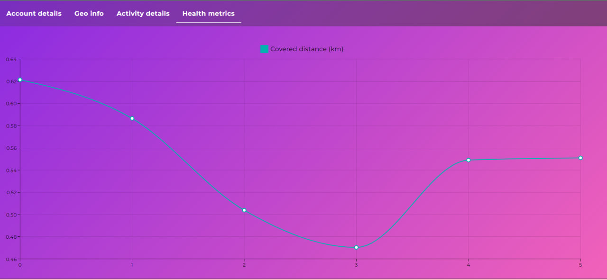
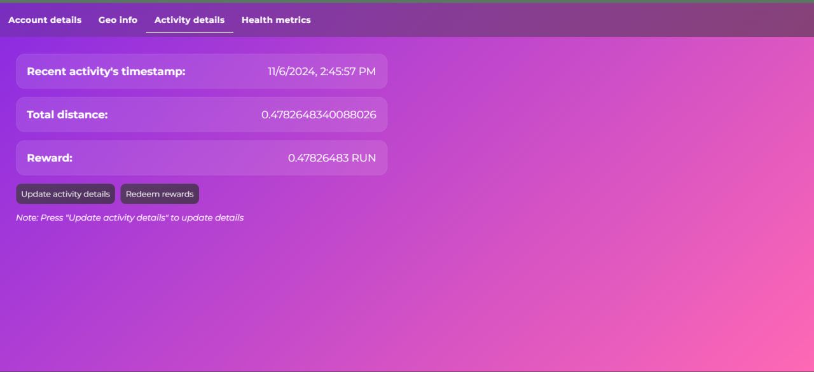

# Run to Earn

Run to Earn is a decentralized platform that incentivizes users to engage in physical activities, such as running, by earning cryptocurrency or rewards.

## Prerequisites

You should have Metamask on you default browser

## To start project

To start project you need to run `npm install` for both server and client folder.
Then move to server folder and run `npm run auto-dev`
For the client run `npm run dev`.

Connect account from Ganache to MetaMask using a private key.

Enjoy our project.

## Demos

## STAY HARD! THEY DON'T KNOW ME, SON